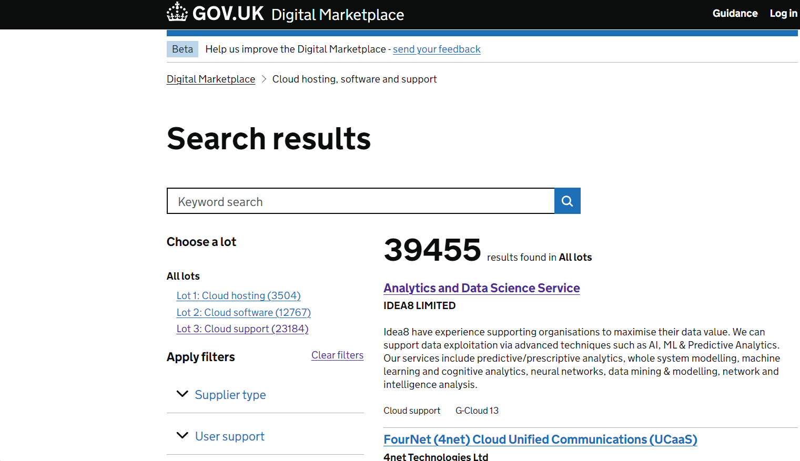
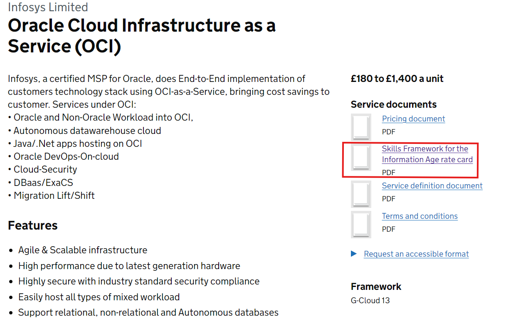
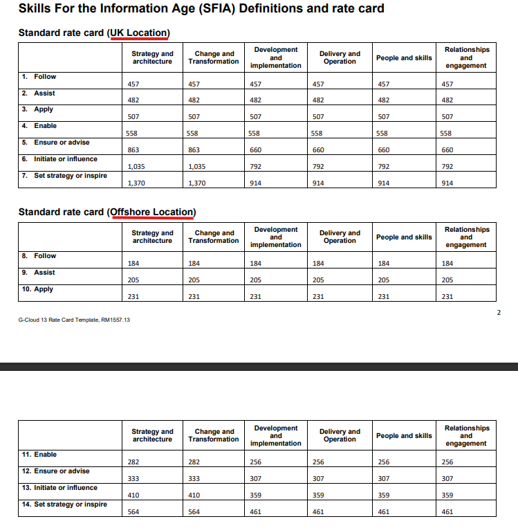

## The Digital Marketplace

Generally private sector companies do not publicly share details on consultancy rates, however when it comes to offering services for the public sector (UK government), pricing must be made publicly available.

The UK government hosts a [Digital Marketplace](https://www.applytosupply.digitalmarketplace.service.gov.uk/) where public sector buyers can "Find technology or people for digital projects in the public sector" and suppliers of these services can list them.

Digital services are split into 3 categories (or lots as they're called on the marketplace):

1. **Lot 1: Cloud hosting**  
    - Platform or infrastructure services for running software, networking, or processing and storing data. E.g. content delivery networks or load balancing services.

2. **Lot 2: Cloud software**
    - Applications that are accessed over the internet and hosted in the cloud. E.g. accounting tools or customer service management software.

3. **Lot 3: Cloud Support**
    - Services to help you set up and maintain your cloud software or hosting services. E.g. migration services or ongoing support.

As these are all digital services, all are included in our search. 

### Searching the Marketplace

Services offered by a company is found by using the the search bar near the top of the webpage, as seen in figure 2.1.

  
  <figcaption>Figure 2.1: Main search page for services provided by consultancies.</figcaption>

The keyword search is a very simple implementation and looks for any occurence of the search term in the company name, service or small description provided for each service. For example when searching for "AND Digital" will return any services where the word "and" exists in addition to services offered by the company "Methods Business and Digital Technology Limited", as it contains "and digital" in the required order.

### Service pages

After searching for a service, company or keyword a user can click on the service name, which itself is a hyperlink, to open a webpage outlining in more detail the service and other information such as pricing, as seen in figure 2.2 below. 

  
  <figcaption>Figure 2.2: Example of Infosys service offering (04/07/2024).</figcaption>

Taking the above page as an example there are several key pieces of data of interest:

1. The company name: **Infosys Limited**
2. The service on offer here: **Oracle Cloud infrastructure as a Service (OCI)**
3. The rate card (SFIA): **Skills Framework for the Information Age rate card** 
4. Service price: **£180 to £1,400 a unit**

### Use cases for the above data

- Service on offer has potential to understand relationship between different services and their pricing schemes.
- Rate card pdf contains day rates for consultants of varying ability (SFIA standard).
- In the case a competitor display no rate card use service price to obtain estimate of day rate range (minimum and maximum).
- Service price may be price for something other than a consultant - potential future analysis of other priceing types, see more detailed explanation below.

### More detailed explanation

The primary goal of this project is to have a final table of each competitor and their rate cards and the rate card is downloaded, however not every company offers a rate card under the "Service documents" section, hence why the service price is also extracted. In addition this there are many pricing schemes not just per unit (we can take this to mean per consultant). The other pricing schemes will be detailed in another section but an example is "£x per licence" when a consultancy offers an PaaS solution that was developed in-house (e.g. when a company buys a MS SQL server licence). Even though understanding pricing schemes for licences is not in the current scope for this project, long term this Kubrick could use this data to understand how different products are priced in the technology consultancy space.  

A similar line of thinking is applied to the service offered, where there is potential to understand the relationship between the service type and the unit (consultant) rate. In addition to this, there is potential to understand the relationship between how pricing may vary depending on the tech stack. None of this has been explored however collecting this data now allows analysis of these relationships at the present and also compare to the future when competitors update their service offerings and potentially increase rates for tech stacks they identify to lack experts in (emerging technologies in the field).

### Competitors in Digital Marketplace

In the overaching MI project there are 137 competitors that have been identified and below is a summary of the companies and their data available on the Digital Marketplace:

|  Measure   | Number of companies (incl. Kubrick Group)     |
| :---------- | :------------------------------------------- |
| MI identified companies                              | 137 |
| Companies offering services on Digital Marketplace   | 42  |
| Companies with a Rate Card on Digital Marketplace    | 33  |

  <figcaption>Figure 2.3: Summary of companies availble on Digital marketplace.</figcaption>  

| Index | company                                                            | Number of rate cards |
|-------|--------------------------------------------------------------------|-------|
| 0     | Infosys Limited                                                    | 15    |
| 1     | Cognizant Worldwide Limited                                        | 4     |
| 2     | KPMG LLP                                                           | 2     |
| 3     | Sparta Global Limited (formerly Testing Circle Limited)            | 2     |
| 4     | Equal Experts UK Limited                                           | 2     |
| 5     | Kainos Software Ltd / Kainos Worksmart Limited                     | 2     |
| 6     | Tata Consultancy Services Limited                                  | 1     |
| 7     | Ten10 Solutions Limited                                            | 1     |
| 8     | The Public Service Consultants (trading as ThePSC)                 | 1     |
| 9     | Mason Advisory Limited                                             | 1     |
| 10    | Slalom Consulting                                                  | 1     |
| 11    | Thoughtworks Limited                                               | 1     |
| 12    | PROJECTONE CONSULTING LIMITED                                      | 1     |
| 13    | PROJECTIVE GROUP UK LIMITED                                        | 1     |
| 14    | NorthHighland                                                      | 1     |
| 15    | Wavestone Advisors UK Limited                                      | 1     |
| 16    | Mosaic Island                                                      | 1     |
| 17    | Softwire Technology Limited                                        | 1     |
| 18    | Adatis                                                             | 1     |
| 19    | Kubrick Group                                                      | 1     |
| 20    | Alchemmy Consulting Ltd                                            | 1     |
| 21    | IQVIA LTD.                                                         | 1     |
| 22    | FDM GROUP                                                          | 1     |
| 23    | Ernst & Young LLP (EY)                                             | 1     |
| 24    | Eden McCallum LLP                                                  | 1     |
| 25    | Deloitte LLP                                                       | 1     |
| 26    | Clarasys Limited                                                   | 1     |
| 27    | Capita Business Services Limited                                   | 1     |
| 28    | Capgemini UK plc                                                   | 1     |
| 29    | CGI                                                                | 1     |
| 30    | BetterGov                                                          | 1     |
| 31    | BJSS Limited                                                       | 1     |
| 32    | Zoonou Limited                                                     | 1     |  
| 33    | Credera Limited                                                    | 0     |
| 34    | Baringa Partners                                                   | 0     |
| 35    | Billigence                                                         | 0     |
| 36    | The Boston Consulting Group UK LLP                                 | 0     |
| 37    | McKinsey & Company, Inc. United Kingdom                            | 0     |
| 38    | Prolifics Inc                                                      | 0     |
| 39    | PricewaterhouseCoopers (LLP) PwC                                   | 0     |
| 40    | Testhouse Ltd                                                      | 0     |
| 41    | The Berkeley Partnership                                           | 0     |

  <figcaption>Figure 2.4: Companies available on the Digital Marketplace and how many ratecards they have.</figcaption>

## Skills framework for the information age (SFIA)

- **Generally, the SFIA rate card should be where consultancies display day rates for consultants of varying ability and role**

The SFIA rate cards are a way of showing the price of a resource-based service based on the skills, competencies and levels of responsibility of the resources.

Using the SFIA categories all consultancies will define day rates accordingly. Even though this is supposedly a standard it is likely the ability of consultants who are in the same SFIA category could differ as each company will have a slightly different understanding of whta level of ability maps to a SFIA category.

### Levels of responsibility in SFIA

The levels and their definitions can be found at on the [SFIA website](https://sfia-online.org/en/sfia-8/responsibilities), but they have been listed below. Essentially level 1 can be seen as a junior consultant while level 7 is a delivery lead type consultant, and everything in between is between these two.

1. Level 1 - Follow
2. Level 2 - Assist
3. Level 3 - Apply
4. Level 4 - Enable
5. Level 5 - Ensure, advise
6. Level 6 - Initiate, influence
7. Level 7 - Set Strategy, inspire, mobilise

An example SFIA rate card can be seen below in figure 2.5, where Infosys have displayed their onshore and offshore rates (underlined in red).

  <figcaption>Figure 2.5: Example SFIA rate card (Infosys Limited).</figcaption>

## Insights from scraped data

To date the key insights that have been developed are the following:

- Day rate disributions for:
    1. Most Junior consultant
    2. Most Senior consultant
    3. daye rate difference between most junior and senior consultants (range)

2. Monte carlos for the above to understand the range of possible outcomes and the probability of different rates occurring.

